<p align="center">
  
</p>

<p align="center">
  
</p>

<p align="center">
  <a href="https://github.com/OliverAven01">
    
  </a>
  <a href="https://www.linkedin.com/in/oliverchuctaya">
    
  </a>
  <a href="mailto:oliveraven05@gmail.com">
    
  </a>
  <a href="https://oliveraven01.biox.com.pe/">
    
  </a>
</p>

<p align="center">
  
  
</p>

---

## 👨‍💻 Sobre mí

<table>
<tr>
<td width="32%" align="center" valign="middle">


<br><br>

### OLIVER CHUCTAYA

**Software Engineer**

`Full-Stack` · `Cloud` · `AI`

</td>

<td width="68%" valign="top">

Soy desarrollador de software enfocado en construir aplicaciones modernas, escalables y orientadas a resolver problemas reales.

Mi experiencia abarca el desarrollo **Full-Stack**, aplicaciones móviles, APIs REST, bases de datos, arquitectura cloud, automatización e integración de inteligencia artificial.

Me interesa especialmente transformar ideas en productos funcionales combinando **buen diseño, código mantenible y una arquitectura sólida**.

### Actualmente enfocado en

* 🚀 Desarrollo Full-Stack
* ☁️ Arquitectura Cloud & DevOps
* 🤖 Inteligencia Artificial aplicada
* 📱 Aplicaciones móviles
* 🔌 APIs y sistemas distribuidos
* 🧠 Arquitectura y buenas prácticas de software

</td>
</tr>
</table>

---

## 🧩 Especialidades

<table align="center">
<tr>

<td align="center" width="25%">


### Frontend

React · TypeScript
Next.js · Vite
UI moderna · Responsive

</td>

<td align="center" width="25%">


### Backend

Node.js · Express
Django · Spring
APIs REST · JWT

</td>

<td align="center" width="25%">


### Cloud

AWS · Docker
Railway · Vercel
CI/CD · Deployments

</td>

<td align="center" width="25%">


### IA & IoT

Python · Gemini
MediaPipe · ESP32
Automatización · IoT

</td>

</tr>
</table>

---

# 🚀 Proyectos destacados

<table>
<tr>

<td width="50%" valign="top">

## 💳 LUKA

**Sistema de pagos y recompensas mediante NFC**

Plataforma orientada al transporte público que integra pagos NFC, gestión de usuarios y recompensas digitales.

**Stack**

`React` `TypeScript` `Node.js` `Python` `NFC`

<br>

<a href="https://github.com/OliverAven01/Luka-Frontend">

</a>

</td>

<td width="50%" valign="top">

## 🛒 BIOX

**E-commerce + sistema MLM**

Sistema empresarial con gestión de productos, afiliados, rangos, comisiones, autenticación y panel administrativo.

**Stack**

`Node.js` `Express` `React` `Vite` `MySQL` `JWT`

<br>

`PRIVATE PROJECT`

</td>

</tr>

<tr>

<td width="50%" valign="top">

## 🧠 AVEN

**Aplicación móvil de autocuidado y filosofía**

Aplicación con inteligencia artificial, mentor por filosofía, feed social, XP, rachas, medallas y quiz de personalidad.

**Stack**

`React` `Capacitor` `TypeScript` `Tailwind` `Node.js` `SQLite` `Gemini`

<br>

`PRIVATE PROJECT`

</td>

<td width="50%" valign="top">

## 🆘 SOS EN SEÑAS

**Reconocimiento de lenguaje de señas con IA**

Sistema capaz de reconocer señas en tiempo real para generar alertas de emergencia y facilitar la comunicación.

**Stack**

`React` `TypeScript` `MediaPipe` `Capacitor` `Supabase`

<br>

`PRIVATE PROJECT`

</td>

</tr>

<tr>

<td width="50%" valign="top">

## 🧾 PUNTO DE VENTA

Sistema POS para gestión de productos, inventario, ventas y reportes.

**Stack**

`JavaScript` `Node.js` `MySQL`

<br>

<a href="https://github.com/OliverAven01/Punto-Venta">

</a>

</td>

<td width="50%" valign="top">

## 🎬 MOVIE APP

Aplicación web para consultar películas mediante APIs externas, con interfaz responsive.

**Stack**

`JavaScript` `React` `API REST`

<br>

<a href="https://github.com/OliverAven01/movieapp01">

</a>

</td>

</tr>
</table>

---

# 🛠️ Tech Stack

### Frontend

<p>

</p>

### Backend

<p>

</p>

### Database & Cloud

<p>

</p>

### Tools

<p>

</p>

---

# 📊 GitHub Analytics

<p align="center">
  
  
</p>

<p align="center">
  
</p>

<p align="center">
  
</p>

---

# 🏆 GitHub Achievements

<p align="center">
  
</p>

---

# 💼 Experiencia

<table>
<tr>

<td width="50%" valign="top">

### Freelance

Desarrollo de soluciones personalizadas para clientes, incluyendo:

* Sistemas de gestión
* Plataformas web
* E-commerce
* APIs
* Integraciones
* Prototipos funcionales

Desde el análisis de requisitos hasta el despliegue.

</td>

<td width="50%" valign="top">

### Desarrollo empresarial

Participación en proyectos orientados a:

* Aplicaciones corporativas
* Sistemas internos
* Modernización de aplicaciones
* Mantenimiento de sistemas
* Migración tecnológica
* Automatización de procesos

</td>

</tr>
</table>

---

# 📈 Lo que busco

```text
Construir
    ↓
Software escalable
    ↓
Resolver problemas reales
    ↓
Crear productos útiles
    ↓
Seguir aprendiendo
```

Me interesa participar en proyectos donde pueda aportar en **desarrollo de software, arquitectura, cloud, inteligencia artificial y productos digitales**.

---

# 🤝 Conectemos

<p align="center">

¿Tienes un proyecto, una idea o simplemente quieres conversar sobre tecnología?

<br>

**Estoy abierto a nuevas oportunidades y colaboraciones.**

<br><br>

<a href="https://www.linkedin.com/in/oliverchuctaya">

</a>

<a href="mailto:oliveraven05@gmail.com">

</a>

<a href="https://oliveraven01.biox.com.pe/">

</a>

</p>

---

<p align="center">
  
</p>

<p align="center">
  <sub>Designed & built by <b>Oliver Chuctaya</b> · Arequipa, Peru 🇵🇪</sub>
</p>
