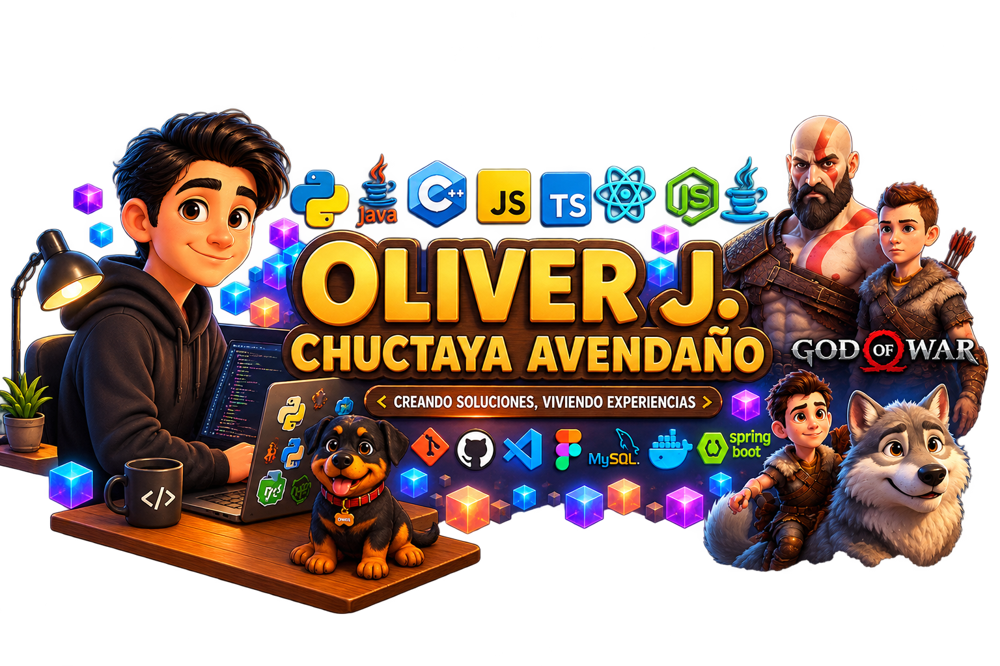

<div align="center">
  
</div>

<div align="center">
  
</div>

<div align="center">
  <a href="https://www.linkedin.com/in/oliverchuctaya" target="_blank"></a>
  <a href="https://github.com/OliverAven01" target="_blank"></a>
  <a href="https://wa.me/51963072856" target="_blank"></a>
  <a href="mailto:oliveraven05@gmail.com" target="_blank"></a>
  <a href="https://oliveraven01.biox.com.pe/" target="_blank"></a>
</div>

<div align="center">
  
  
  
  
</div>

<br>

---

## `// SOBRE MÍ`

<table>
  <tr>
    <td width="30%" valign="top" align="center">
      
      <br><br>
      <sub>`root@oliver:~# whoami`</sub><br>
      <b>Oliver Chuctaya Avendaño</b><br>
      <sub>Arequipa, Perú</sub>
    </td>
    <td width="70%" valign="top">
      <p>
        Ingeniero de software peruano con experiencia en desarrollo full-stack, arquitectura cloud-native y sistemas distribuidos. He trabajado tanto en proyectos freelance como en entornos corporativos, construyendo aplicaciones web, sistemas de gestión, apps móviles y soluciones con inteligencia artificial.
      </p>
      <p>
        Me enfoco en escribir código limpio y bien estructurado, diseñar arquitecturas escalables y entregar software que realmente resuelva problemas. Actualmente trabajo con <code>React</code>, <code>Node.js</code>, <code>TypeScript</code>, <code>AWS</code> y <code>Docker</code>, y estoy abierto a nuevos proyectos y colaboraciones.
      </p>
    </td>
  </tr>
</table>

```text
STATUS............: OPERACIONAL
ROL................: Ingeniero de Software
ESPECIALIZACIÓN...: Full-Stack · Cloud · IA
STACK ACTIVO......: React · Node.js · TypeScript · AWS · Docker
UBICACIÓN.........: Arequipa, Perú
DISPONIBILIDAD...: Abierto a colaboraciones
```

<br>

### Especialidades

<table align="center">
  <tr>
    <td align="center" width="25%">
      <br>
      <b>Arquitectura Cloud</b><br>
      <sub>AWS · Docker · Microservicios</sub>
    </td>
    <td align="center" width="25%">
      <br>
      <b>Desarrollo Full-Stack</b><br>
      <sub>React · Node.js · TypeScript</sub>
    </td>
    <td align="center" width="25%">
      <br>
      <b>Sistemas Distribuidos</b><br>
      <sub>APIs · Escalabilidad · Rendimiento</sub>
    </td>
    <td align="center" width="25%">
      <br>
      <b>Buenas Prácticas</b><br>
      <sub>Clean Code · CI/CD · Testing</sub>
    </td>
  </tr>
</table>

---

## `// ANALÍTICA DEL SISTEMA`

<div align="center">
  
</div>

<br>

<div align="center">
  
  
</div>

<br>

<div align="center">
  
</div>

<br>

<div align="center">
  
</div>

<br>

<div align="center">
  
</div>

---

## `// REGISTRO DE SERVICIO`

<table align="center">
  <tr>
    <td width="50%" valign="top">
      <h3 align="center"><b>Freelance</b></h3>
      <p align="center"><sub>Proyectos personalizados para clientes: sistemas de gestión, plataformas web, integraciones y prototipos funcionales. Trabajo directo desde la toma de requisitos hasta el despliegue final.</sub></p>
    </td>
    <td width="50%" valign="top">
      <h3 align="center"><b>Empresa</b></h3>
      <p align="center"><sub>Desarrollo interno corporativo, construcción de aplicaciones a medida, mantenimiento de sistemas legacy y migración a arquitecturas modernas con enfoque en calidad y buenas prácticas.</sub></p>
    </td>
  </tr>
</table>

---

## `// ARCHIVOS DE MISIÓN`

<table align="center">
  <tr>
    <td width="50%" valign="top" align="center">
      <b><a href="https://github.com/OliverAven01/Punto-Venta">Punto-Venta</a></b> <sub>(PÚBLICO)</sub><br><br>
      <sub>POS con JavaScript, Node.js y MySQL. Gestión de inventario, ventas y reportes.</sub><br><br>
      
      
    </td>
    <td width="50%" valign="top" align="center">
      <b><a href="https://github.com/OliverAven01/LectorNfcLUKA">LectorNfcLUKA</a></b> <sub>(PÚBLICO)</sub><br><br>
      <sub>Lector NFC en Python para control de acceso y registro de datos.</sub><br><br>
      
      
    </td>
  </tr>
  <tr>
    <td width="50%" valign="top" align="center">
      <b><a href="https://github.com/OliverAven01/Luka-Frontend">Luka-Frontend</a></b> <sub>(PÚBLICO)</sub><br><br>
      <sub>Frontend con TypeScript y React. Componentes modulares y consumo de APIs.</sub><br><br>
      
    </td>
    <td width="50%" valign="top" align="center">
      <b><a href="https://github.com/OliverAven01/movieapp01">movieapp01</a></b> <sub>(PÚBLICO)</sub><br><br>
      <sub>App web de películas con APIs externas y diseño responsive.</sub><br><br>
      
    </td>
  </tr>
  <tr>
    <td width="50%" valign="top" align="center">
      <b>BIOX</b> <sub>(CLASIFICADO)</sub><br><br>
      <sub>Sistema e-commerce con MLM: Node.js, Express, React 18, Vite y MySQL. 16 rangos de afiliación, comisiones directas en SOLES, breakage automático, panel administrativo y autenticación JWT. Desplegado en Railway.</sub>
    </td>
    <td width="50%" valign="top" align="center">
      <b>Aven</b> <sub>(CLASIFICADO)</sub><br><br>
      <sub>App móvil de autocuidado con enfoque filosófico: React 19, Capacitor, TypeScript, Tailwind, Framer Motion, Node.js + SQLite. IA con Gemini: mentor por clan filosófico, feed social, rachas, medallas, XP y quiz de personalidad.</sub>
    </td>
  </tr>
  <tr>
    <td width="100%" valign="top" align="center" colspan="2">
      <b>SOS en SEÑAS</b> <sub>(CLASIFICADO)</sub><br><br>
      <sub>Reconocimiento de lenguaje de señas en tiempo real con IA para alertas de emergencia. React, TypeScript, Vite, Tailwind, shadcn/ui y Capacitor. MediaPipe Handpose, base de datos de señas personalizadas, alertas SOS, text-to-speech y Supabase.</sub>
    </td>
  </tr>
</table>

---

## `// SISTEMAS DE TECNOLOGÍA`

<div align="center">
  <table>
    <tr>
      <td align="center"><b>Frontend</b></td>
      <td align="center"><b>Backend</b></td>
      <td align="center"><b>Datos & Nube</b></td>
    </tr>
    <tr>
      <td align="center">
        
      </td>
      <td align="center">
        
      </td>
      <td align="center">
        
      </td>
    </tr>
    <tr>
      <td colspan="3" align="center">
        
      </td>
    </tr>
  </table>
</div>

<br>

<div align="center">
  
  
  
  
  
  
  
  
</div>

---

## `// PROTOCOLOS DE OPERACIÓN`

```text
CLEAN CODE
    ↓
ARQUITECTURA MANTENIBLE
    ↓
SISTEMAS ESCALABLES
    ↓
SOFTWARE CONFIABLE
    ↓
IMPACTO EN EL MUNDO REAL
```

---

## `// TRANSMISIÓN`

<p align="center">
  Si te interesa colaborar en un proyecto, tienes una idea que quisieras discutir o simplemente quieres conectar, estaré encantado de conversar.
</p>

<div align="center">
  <a href="https://www.linkedin.com/in/oliverchuctaya" target="_blank">
    
  </a>
  <a href="https://wa.me/51963072856" target="_blank">
    
  </a>
  <a href="mailto:oliveraven05@gmail.com" target="_blank">
    
  </a>
  <a href="https://oliveraven01.biox.com.pe/" target="_blank">
    
  </a>
</div>

<br>

<div align="center">
  <code>STATUS: OPERATIVO</code> · <b>Arequipa, Perú</b>
</div>

<br>

<div align="center">
  
</div>
